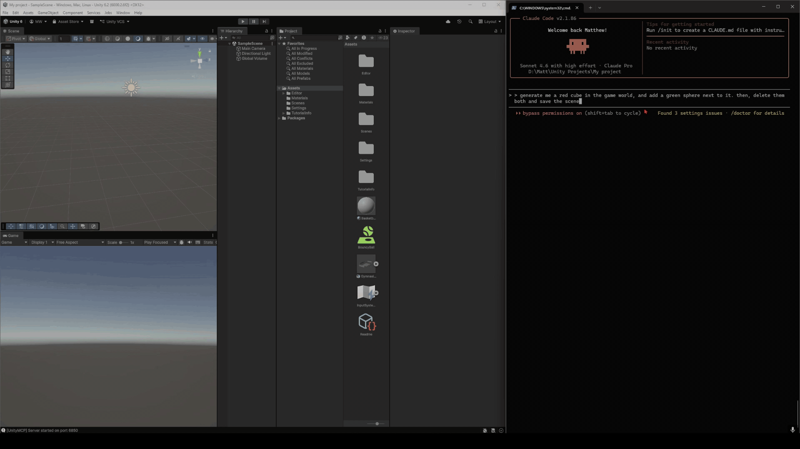

# Unity MCP Server

An MCP (Model Context Protocol) server that enables AI assistants like Claude to view and interact with the Unity Editor in real-time. Create GameObjects, modify components, control play mode, manage materials, build terrain, run particle effects, and more — all through natural language.



## Features

- **69 MCP Tools** for comprehensive Unity Editor control
- **Real-time scene inspection** - View hierarchy, components, and properties
- **Full CRUD operations** - Create, modify, delete GameObjects and components
- **Material system** - Create, modify, and assign materials
- **Scene management** - Load, save, and list scenes
- **Play mode control** - Start, stop, pause, and step through gameplay
- **Screenshot capture** - Capture Scene or Game view as base64 images (AI-viewable)
- **C# code execution** - Run arbitrary C# at runtime — the universal escape hatch
- **UI System (UGUI)** - Canvas, Text, Button, Image, Slider, InputField, and more
- **Lighting & Environment** - Create/modify lights, control skybox, ambient, and fog
- **Physics** - Add Rigidbodies and colliders, configure global physics settings
- **Animation** - Inspect Animator state/parameters, set parameters, play clips
- **Prefab workflow** - Create, unpack, apply/revert overrides
- **Particle Systems** - Create, configure, and control particle effects
- **Terrain tools** - Create, sculpt, paint, and populate terrain
- **Batch operations** - Modify or delete multiple GameObjects at once
- **Profiler data** - Memory, rendering, object counts, and physics stats
- **Undo/Redo support** - All write operations are undoable
- **Thread-safe** - Properly handles Unity's main thread requirements

## Architecture

```
┌─────────────────┐         ┌─────────────────┐         ┌─────────────────┐
│  Claude Code /  │         │   MCP Server    │         │  Unity Editor   │
│  AI Assistant   │ ←─MCP─→ │   (Node.js)     │ ←─HTTP─→│  (C# Bridge)    │
└─────────────────┘         └─────────────────┘         └─────────────────┘
```

## Quick Start

### 1. Unity Setup

Copy the `Assets/Editor/UnityMCPBridge/` folder into your Unity project's `Assets/Editor/` directory.

**Requirements:**
- Unity 6+ (uses modern APIs like `FindObjectsByType`)
- Newtonsoft.Json (`com.unity.nuget.newtonsoft-json`) - usually included by default

The server auto-starts when Unity opens. Check the console for:
```
[UnityMCP] Server started on port 6850
```

**Verify it's working:**
```bash
curl http://localhost:6850/ping
# Returns: {"status":"ok","editor":"Unity","port":6850}
```

### 2. MCP Server Setup

```bash
cd unity-mcp-server
npm install
npm run build
```

### 3. Configure Claude Code

Add to your MCP settings file (`~/.claude.json` or via settings UI):

```json
{
  "mcpServers": {
    "unity": {
      "command": "node",
      "args": ["/path/to/unity-mcp-server/dist/index.js"]
    }
  }
}
```

Restart Claude Code after adding the configuration.

## Available Tools (69 Total)

### Scene & Hierarchy

| Tool | Description |
|------|-------------|
| `unity_ping` | Check if Unity Editor is connected |
| `unity_get_project` | Get project info, version, and play mode status |
| `unity_get_scene` | Get scene hierarchy with GameObjects and components |
| `unity_get_gameobject` | Get detailed info about a specific GameObject |
| `unity_get_components` | Get all components on a GameObject with properties |
| `unity_get_selection` | Get currently selected objects in the editor |
| `unity_find_gameobjects` | Search for GameObjects by name, tag, layer, or component |

### GameObject Operations

| Tool | Description |
|------|-------------|
| `unity_create_gameobject` | Create empty or primitive GameObjects (Cube, Sphere, etc.) |
| `unity_modify_gameobject` | Change name, transform, parent, active state, etc. |
| `unity_delete_gameobject` | Delete a GameObject from the scene |

### Component Operations

| Tool | Description |
|------|-------------|
| `unity_add_component` | Add any component (Rigidbody, Collider, custom scripts) |
| `unity_remove_component` | Remove a component from a GameObject |
| `unity_set_property` | Set any serialized property on a component |

### Materials

| Tool | Description |
|------|-------------|
| `unity_get_material` | Get material info including shader and all properties |
| `unity_create_material` | Create a new material with specified shader and color |
| `unity_modify_material` | Change material color or shader properties |
| `unity_assign_material` | Assign a material to a GameObject's renderer |

### Scene Management

| Tool | Description |
|------|-------------|
| `unity_list_scenes` | List all scenes in the project |
| `unity_load_scene` | Load a scene (single or additive) |
| `unity_save_scene` | Save the current scene |

### Assets

| Tool | Description |
|------|-------------|
| `unity_get_assets` | Search project assets with Unity filter syntax |
| `unity_get_scripts` | List MonoBehaviour scripts in the project |
| `unity_instantiate_prefab` | Instantiate a prefab into the scene |
| `unity_refresh_assets` | Refresh the Asset Database |

### Prefab Workflow

| Tool | Description |
|------|-------------|
| `unity_create_prefab` | Save a scene GameObject as a prefab asset |
| `unity_unpack_prefab` | Disconnect a prefab instance from its asset |
| `unity_apply_prefab_overrides` | Push scene instance changes back to the prefab asset |
| `unity_revert_prefab_overrides` | Restore a prefab instance to the asset's state |
| `unity_get_prefab_info` | Check prefab status, asset path, and override state |

### Editor Control

| Tool | Description |
|------|-------------|
| `unity_set_playmode` | Control play mode (play, stop, pause, step) |
| `unity_undo` | Undo the last operation |
| `unity_redo` | Redo the last undone operation |
| `unity_get_console` | Get recent console logs, warnings, and errors |

### Screenshot Capture

| Tool | Description |
|------|-------------|
| `unity_take_screenshot` | Capture Scene or Game view as an image (returns base64 + optional save to disk) |

### Code Execution

| Tool | Description |
|------|-------------|
| `unity_execute_code` | Execute arbitrary C# code in the Unity Editor at runtime |

### UI System (Canvas/UGUI)

| Tool | Description |
|------|-------------|
| `unity_create_ui_element` | Create UI elements: Canvas, Text, Button, Image, Panel, InputField, Slider, Toggle, Dropdown, ScrollView, RawImage |
| `unity_modify_ui_element` | Modify UI element properties (text, color, size, anchors, interactable state) |

### Lighting & Environment

| Tool | Description |
|------|-------------|
| `unity_create_light` | Create a Directional, Point, Spot, or Area light |
| `unity_modify_light` | Change light color, intensity, range, spot angle, or shadow type |
| `unity_get_light_info` | Read all Light component properties |
| `unity_set_environment` | Set skybox, ambient mode/colors, fog, and reflection intensity |
| `unity_get_environment` | Read all current RenderSettings values |

### Physics

| Tool | Description |
|------|-------------|
| `unity_add_rigidbody` | Add/configure a Rigidbody (mass, drag, gravity, kinematic, constraints) |
| `unity_add_collider` | Add a Box, Sphere, Capsule, or Mesh collider |
| `unity_set_physics_settings` | Modify global physics: gravity, solver iterations, thresholds |
| `unity_get_physics_settings` | Read current global physics configuration |

### Animation

| Tool | Description |
|------|-------------|
| `unity_get_animator_info` | Get Animator parameters, layers, clips, and current state |
| `unity_set_animator_parameter` | Set a float, int, bool, or trigger parameter (Play mode) |
| `unity_play_animation` | Play a named animation state on a specific layer (Play mode) |

### Particle Systems

| Tool | Description |
|------|-------------|
| `unity_create_particle_system` | Create a particle system with shape, emission, color, speed, and lifetime |
| `unity_modify_particle_system` | Modify any particle system property; supports min/max random ranges |
| `unity_play_particle_system` | Play, pause, stop, or restart a particle system |
| `unity_get_particle_system_info` | Read current particle system settings and playback state |

### Sprites

| Tool | Description |
|------|-------------|
| `unity_import_sprite` | Import an image file as a sprite asset |
| `unity_configure_sprite` | Configure sprite settings on an existing texture asset |
| `unity_slice_spritesheet` | Slice a sprite sheet into multiple sprites by grid |
| `unity_create_sprite_renderer` | Add a SpriteRenderer to a GameObject with a specified sprite |

### Profiler & Performance

| Tool | Description |
|------|-------------|
| `unity_get_profiler_data` | Get memory usage, object/asset counts, rendering settings, physics config, timing info |

### Batch Operations

| Tool | Description |
|------|-------------|
| `unity_batch_modify` | Modify multiple GameObjects at once (by IDs or filter). Set tag, layer, active state, transform, add/remove components |
| `unity_batch_delete` | Delete multiple GameObjects at once (by IDs or filter) |

### Terrain

| Tool | Description |
|------|-------------|
| `unity_create_terrain` | Create a terrain with specified dimensions and resolution |
| `unity_modify_terrain_height` | Modify terrain heightmap (set, raise, lower, smooth, flatten, perlin noise) |
| `unity_paint_terrain_texture` | Add terrain texture layers and paint them on the terrain |
| `unity_place_terrain_trees` | Scatter trees on terrain with configurable density, scale, and area |
| `unity_get_terrain_info` | Get terrain info: size, resolution, layers, tree prototypes |

## Example Usage

Once configured, you can use natural language with Claude:

**Scene Inspection:**
- "Show me the scene hierarchy"
- "What components are on the Main Camera?"
- "Find all GameObjects with a Rigidbody"

**Creating Objects:**
- "Create a red cube at position (0, 5, 0)"
- "Add a Sphere named 'Ball' as a child of the Player"
- "Instantiate the Enemy prefab at the spawn point"

**Modifying Objects:**
- "Move the Player to position (10, 0, 5)"
- "Add a Rigidbody to the Cube and set its mass to 5"
- "Change the light intensity to 2.5"

**Materials:**
- "Create a blue metallic material called 'Ocean'"
- "Assign the Glass material to all windows"
- "Make the floor material more reflective"

**Play Mode:**
- "Start play mode"
- "Pause the game"
- "Step one frame forward"

**Scene Management:**
- "Save the current scene"
- "Load the MainMenu scene"
- "What scenes are in this project?"

**Screenshot & Inspection:**
- "Take a screenshot of the game view"
- "Show me what the scene looks like from the scene camera"
- "Get the profiler data and memory usage"

**Code Execution:**
- "Run this C# code: Debug.Log(Camera.main.transform.position);"
- "Execute code to print all shader names in the project"

**UI System:**
- "Create a Canvas with a title text saying 'Game Over'"
- "Add a Start Button to the main menu canvas"
- "Create a health bar slider"

**Lighting & Environment:**
- "Add a warm point light above the player"
- "Change the directional light to soft shadows"
- "Enable fog with a light grey color and 0.02 density"
- "Set the ambient light to a dark blue for a night scene"

**Physics:**

- "Add a Rigidbody to the Barrel with mass 5 and no gravity"
- "Add a box collider to the Platform"
- "Set gravity to zero for a space game"
- "Make the Bullet use continuous collision detection"

**Animation:**

- "What parameters does the Player's Animator have?"
- "Set the 'Speed' float parameter to 3.5"
- "Trigger the 'Jump' animation"

**Prefab Workflow:**

- "Save the Player GameObject as a prefab at Assets/Prefabs/Player.prefab"
- "Apply all the changes I made to the Enemy instance back to the prefab"
- "Revert the Boss object to its original prefab state"
- "Unpack the Door prefab so I can edit it freely"

**Particle Systems:**

- "Create a fire particle system at the torch position"
- "Make the explosion particles faster with a larger spread angle"
- "Set the smoke emission rate to 50 particles per second"
- "Play the sparkle effect"

**Batch Operations:**
- "Disable all GameObjects tagged 'Enemy'"
- "Add a Rigidbody to all objects named 'Crate'"
- "Delete all objects on the 'Debug' layer"

**Terrain:**
- "Create a 1000x1000 terrain"
- "Apply perlin noise to the terrain heightmap"
- "Paint grass texture on the terrain"
- "Scatter 200 trees across the terrain"

## API Reference

### HTTP Endpoints (Unity Bridge)

**GET Endpoints:**
- `/ping` - Health check
- `/project` - Project information
- `/scene` - Scene hierarchy
- `/scene/detailed` - Deep scene hierarchy (10 levels)
- `/gameobject?id={instanceId}` - GameObject details
- `/components?id={instanceId}` - Component list
- `/assets?filter={filter}` - Asset search
- `/scripts?filter={filter}` - Script list
- `/console` - Console logs
- `/selection` - Current selection
- `/material?path={path}` - Material info
- `/profiler` - Performance and profiling data

**POST Endpoints:**
- `/gameobject/create` - Create GameObject
- `/gameobject/modify` - Modify GameObject
- `/gameobject/delete` - Delete GameObject
- `/component/add` - Add component
- `/component/remove` - Remove component
- `/property/set` - Set property value
- `/playmode` - Control play mode
- `/find` - Find GameObjects
- `/prefab/instantiate` - Instantiate prefab from asset
- `/prefab/create` - Save GameObject as prefab asset
- `/prefab/unpack` - Unpack prefab instance
- `/prefab/apply` - Apply instance overrides to prefab asset
- `/prefab/revert` - Revert instance to prefab asset state
- `/prefab/info` - Get prefab status for a GameObject
- `/scene/save` - Save scene
- `/scene/load` - Load scene
- `/scene/list` - List scenes
- `/undo` - Perform undo
- `/redo` - Perform redo
- `/assets/refresh` - Refresh Asset Database
- `/material/create` - Create material
- `/material/modify` - Modify material
- `/material/assign` - Assign material
- `/sprite/import` - Import image as sprite
- `/sprite/configure` - Configure sprite settings
- `/sprite/slice` - Slice sprite sheet
- `/sprite/renderer/create` - Create SpriteRenderer
- `/screenshot` - Capture screenshot
- `/code/execute` - Execute C# code
- `/ui/create` - Create UI element
- `/ui/modify` - Modify UI element
- `/light/create` - Create light
- `/light/modify` - Modify light
- `/light/info` - Get light info
- `/environment/set` - Set environment/RenderSettings
- `/environment/get` - Get environment/RenderSettings
- `/physics/rigidbody` - Add/configure Rigidbody
- `/physics/collider` - Add collider
- `/physics/settings/set` - Set global physics settings
- `/physics/settings/get` - Get global physics settings
- `/animator/info` - Get Animator info
- `/animator/parameter` - Set Animator parameter
- `/animator/play` - Play animation state
- `/particles/create` - Create particle system
- `/particles/modify` - Modify particle system
- `/particles/play` - Control particle system playback
- `/particles/info` - Get particle system info
- `/batch/modify` - Batch modify GameObjects
- `/batch/delete` - Batch delete GameObjects
- `/terrain/create` - Create terrain
- `/terrain/height` - Modify terrain heightmap
- `/terrain/paint` - Paint terrain textures
- `/terrain/trees` - Place trees on terrain
- `/terrain/info` - Get terrain information

## Troubleshooting

### "Cannot connect to Unity Editor"
- Make sure Unity is open and focused (first request may timeout if Unity is in background)
- Check Unity console for "[UnityMCP] Server started on port 6850"
- Try `curl http://localhost:6850/ping` to verify the bridge is running

### Port already in use
The server automatically tries ports 6850-6859. Check the Unity console for the actual port being used.

### HttpListener access denied (Windows)
If you get access denied errors, register the URL namespace:
```cmd
netsh http add urlacl url=http://localhost:6850/ user=Everyone
```

### Unity domain reload
The server automatically handles Unity's script recompilation and restarts gracefully.

### Property not found

- Property names are case-sensitive
- Use the serialized field name (often starts with lowercase or `m_`)
- Use `unity_get_components` to see available property names

### Animation parameters not returning live values

- `unity_get_animator_info` returns live parameter values only in Play mode
- In Edit mode, it returns the default values from the AnimatorController asset

### Rigidbody uses Unity 6 API names

- `linearDamping` and `angularDamping` replace the deprecated `drag` and `angularDrag` from Unity 6+

## Project Structure

```
UnityMCP/
├── Assets/
│   └── Editor/
│       └── UnityMCPBridge/
│           ├── UnityMCPServer.cs          # HTTP server with thread-safe handling
│           ├── RequestRouter.cs            # Routes requests to handlers
│           ├── Models/
│           │   └── DataModels.cs           # Request/response data classes
│           ├── Providers/
│           │   ├── SceneDataProvider.cs
│           │   ├── AssetDataProvider.cs
│           │   ├── ConsoleDataProvider.cs
│           │   ├── ProjectDataProvider.cs
│           │   ├── SelectionDataProvider.cs
│           │   ├── ScreenshotProvider.cs
│           │   └── ProfilerDataProvider.cs
│           └── Handlers/
│               ├── GameObjectHandler.cs
│               ├── PlayModeHandler.cs
│               ├── ComponentPropertyHandler.cs
│               ├── SceneHandler.cs
│               ├── MaterialHandler.cs
│               ├── SpriteHandler.cs
│               ├── CodeExecutionHandler.cs
│               ├── UIHandler.cs
│               ├── BatchHandler.cs
│               ├── TerrainHandler.cs
│               ├── LightingHandler.cs
│               ├── PhysicsHandler.cs
│               ├── AnimationHandler.cs
│               ├── PrefabHandler.cs
│               └── ParticleSystemHandler.cs
└── unity-mcp-server/
    ├── package.json
    ├── tsconfig.json
    └── src/
        ├── index.ts                        # MCP server with tool definitions
        └── unity-client.ts                 # HTTP client for Unity bridge
```

## Contributing

Contributions are welcome! Some ideas for extensions:

- [ ] Audio system tools (AudioSource, AudioMixer)
- [ ] Script file management (create/read/write .cs files)
- [ ] NavMesh/AI navigation (bake, NavMeshAgent)
- [ ] Build pipeline integration
- [ ] Test runner integration

## License

MIT License - See [LICENSE](LICENSE) file for details.

## Acknowledgments

Built with:
- [Model Context Protocol SDK](https://github.com/modelcontextprotocol/sdk)
- [Newtonsoft.Json](https://www.newtonsoft.com/json) for Unity serialization
